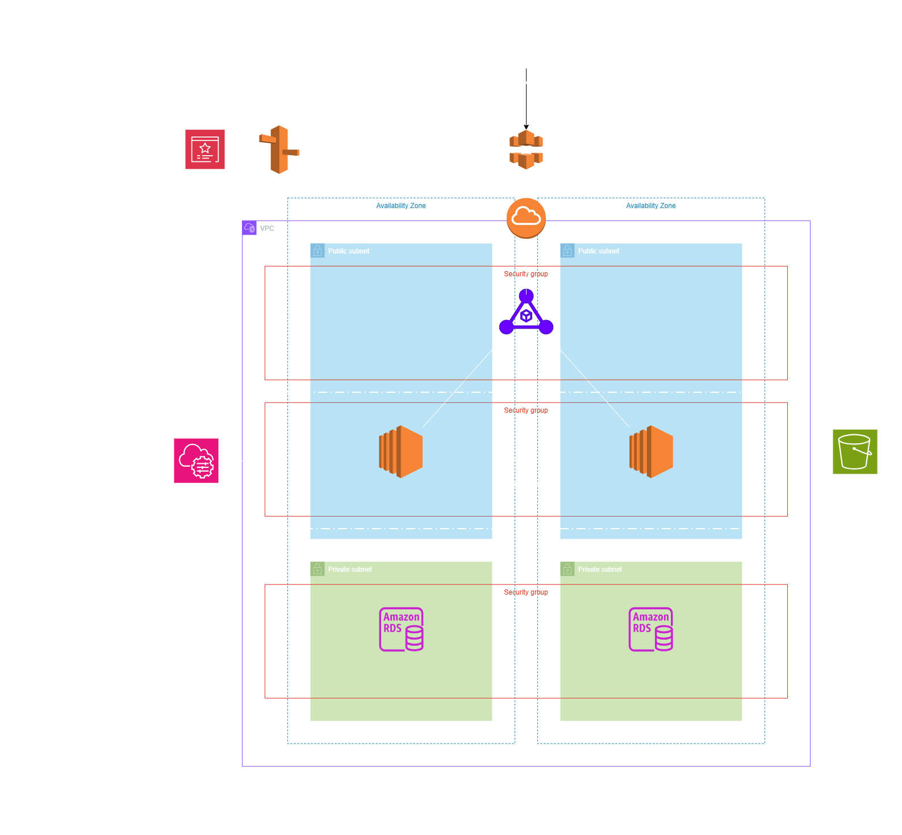
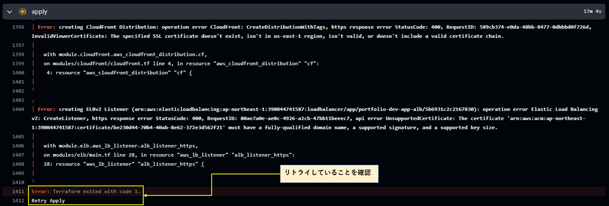
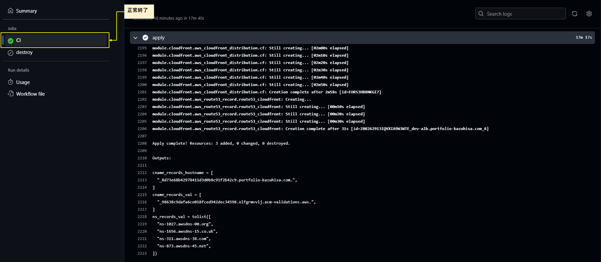

# 1.概要

〇はじめに

このリポジトリはAWSでWEBアプリケーションを展開するためのインフラをterraformやGitHubActisonsなどで自動構築することを目的としたポートフォリオです。

※個人学習用のため若干本番で運用するには推薦できないものもありますので、コメントとして推薦事項等記載しております。


# 2.使用技術/ツール


 〇 技術 🧑‍💻

- ☁️ **AWS**
  - VPC
  - EC2 (AmazonLinux2023)
  - CloudFront
  - Route53
  - ACM
  - ELB
  - IAM
  - RDS
  - S3

- ⚙️ **Terraform**

- 🐚 **Bash**

- 🤖 **GitHub Actions**

---

 〇 ツール 🧰

- **GitBash**
  - GitにCLIでデプロイしたり、terraformコマンドを使ったりするため

- **VSCode**

- **WinMerge**
  - 比較検証や、学習・開発効率化の為

- **draw.io**
  - 設計図作成のため

# 3.基本構成

### ☁️ **インフラ**

3層アーキテクチャ構成により、以下の役割を明確にすることによって、保守性、拡張性が向上します。


1. **プレゼンテーション層(ユーザーとのインターフェース)**  


2. **アプリケーション層(ビジネスロジックの処理)**  


3. **データ層(データの保存・取得)**  


どのレイヤーでエラーが発生しているかを特定することも容易なので、運用面でも優れている構成とも言えます。




---

🖥️ 1. プレゼンテーション層

WEBのセキュリティーグループにAplication Load Barancerを配置しています。世界中からのHTTP/HTTPSのリクエストを可能にしますが、アウトバウンドは宛先がアプリケーション層のセキュリティーグループとなっております。このように、プレゼンテーション層は外部からのアクセスを受け付けつつも、通信の出口は厳密に制限されています。これにより、不要な外部通信を防ぎ、アプリケーション層とのみ安全に連携する構成となっています。

仮にアクセスが集中しアプリケーションに負荷がかかったとしても、ALBで負荷分散できます。宛先をSGを指定することによって、アプリケーション層のインスタンスを動的に増減させた場合でも、ALBが自動的に新しいインスタンスへトラフィックを分散します。エラスティックIPやインスタンスIDに依存せず、柔軟なスケーリングが可能です。

⚙️2. アプリケーション層(ビジネスロジックの処理)

アプリケーションサーバーとしてEC2やASGを使用しています。EC2は立ち上げる際に`user_data.sh`を使用して、自動的にMySQLクライアントやHTTPDをインストールするように設計しました。仮に失敗したとしても失敗した旨をログとして確認できるようにし、後続処理に影響が出ないようにしております。また、ASGを使用してHTTPリクエストが大量に発生した場合でも自動的にスケールイン/スケールアウトしてくれるので、可用性が向上します。

🗄️3.データ層(データの保存・取得)

RDSでEC2インスタンスから受け取ったデータを保存します。外部からの侵入は絶対できないようにプライベートサブネットに入れています。セキュリティーグループのインバウンドはアプリケーションサーバーからのトラフィックに限られており、EC2以外のアクセスをdenyします。RDSはマルチAZ構成にすることで、1つのAZに障害が発生しても自動的にスタンバイインスタンスへフェールオーバーし、サービスを継続できます。今回は学習用途のため、コストを考慮してシングルAZ構成を採用していますが、設計思想としては高可用性を意識した構成となっています。

>**💡 補足**：最近では、マルチクラスター構成が登場しており、従来のマルチAZ構成よりもさらに高速なフェールオーバーと高い可用性を実現できます。これにより、本番環境でもより堅牢なデータ層の構築が可能となっています。

---

### ⚙️ **IaC**

Terraformを使用したIaCを実現し、以下コマンドを打ち込み、DNSの検証を行うだけで瞬時に展開/破壊を可能にしました。

```bash
# デプロイ
terraform init
terraform plan
terraform apply

# デストロイ
terraform destroy
```

### モジュール構成について

本プロジェクトでは、`modules` フォルダ内に各サービスをモジュール化して管理しています。**どのサービスを使って構築しているかが一目で分かるように工夫**しました。

〇モジュール化の目的

1. **可読性の向上**  
   - 各サービスが明確に分離されており、構成の把握が容易

2. **再利用性の向上**  
   - 同様の構成を他プロジェクトでも流用可能

3. **変数管理のしやすさ・見やすさ**  
   - 各モジュールごとに変数が整理されており、保守性が高い


〇デメリット・課題点

   - モジュールが細かすぎるため、**各変数を `output.tf` で指定して `main.tf` で個別に指定する必要**がある

   - どのサービスが**どの層（プレゼンテーション層 / アプリケーション層 / データ層）に属するかが明確でない**ため読み手によっては構成の意図が伝わりにくい可能性あり

> 💡 対策として、今後はVPCやセキュリティーグループであれば`network`モジュールにしたり、より抽象的にするとバランスよいと思います。今の構成だと若干細かい気がするので、最良のモジュール構成を今後は学習していく予定です。

### state管理について

`terraform.tfstate`でstate管理をしている。ローカルで管理する場合、複数人で開発を行うと整合性が取れなくなってしまいます。これを管理・統制するためにS3バックエンドを利用して、デプロイすると同時にS3にstateファイルを格納し、整合性を担保します。

```hcl
backend "s3" {
  bucket       = "dev-portfolio-tfstate-bucket" # リリース対象とは別のアカウントのS3バケットに保存することが推奨される
  key          = "dev.tfstate"
  region       = "ap-northeast-1"
  use_lockfile = true
}
```

---

### 🤖 **CI/CD**

GitHub Actionsを使用した簡単なCI/CDも構築しました。このワークフローを構築することによって、GitHubにプッシュするだけで自動的に指定したコマンドやフローを実行することができます。

`deploy_mode` ファイルの変更をトリガーにして以下の処理を実行します：

- Terraform の初期化、検証、プラン、適用（CI ジョブ）
- 適用に失敗した場合、自動的に `terraform destroy` を実行（destroy ジョブ）

トリガー条件は以下です。

```yaml
on:
  push:
    paths:
      - '**/deploy_mode'
```

`deploy_mode` ファイルが変更されたときにのみ実行されます。

---

フォーマットを整え、構文チェックを行ったあと、インフラをデプロイしていきます。
インフラのデプロイは、成功するまで３回リトライするように設計しています。
詳しい原因はまだ調査中ですが、たまにACMのDNS検証が遅れてしまい、それが影響でエラーが発生しデプロイできないため
再度terraform applyをすることで解決するので、リトライ実行します。


```bash
for i in {1..3}; do
  terraform apply -auto-approve && break
  echo "Retry Apply"
  sleep 60
done
```

あくまでも暫定対応であり、今後は原因を正確に特定し改善することを今後の課題とします。
恐らく依存関係の設定がうまくできていないことが関係していると思います。

### リトライ結果ダンプ

リトライ確認


リトライ後、デプロイ正常終了


# 4.各種README（作成中）

[アプリケーションサーバ（EC2）](modules/ec2/01_README.md)

[証明書発行（ACM）](modules/acm/01_README.md)

[名前解決（Route53）](modules/dns/01_README.md)

[コンテンツ配信ネットワーク(CloudFront)](modules/cloudfront/01_README.md)

[負荷分散（ELB)](modules/elb/01_README.md)


# 5.今後の課題（作成中）

- 環境別構成に改修
  - 🔗 [関連Issue #環境別構成計画](https://github.com/portfolio-kazuhisa/aws_infra_demo/issues/6#issue-3685238185) 
- dns検証の遅れによるエラー発生の恒久的な対策  
  - 🔗 [関連Issue #dns検証の遅れによるエラー発生 ](https://github.com/portfolio-kazuhisa/aws_infra_demo/issues/1#issue-3676375944) 
- セキュリティーグループの見直し(2025/12/1解決)
  - 🔗 [関連Issue #セキュリティーグループの見直し](https://github.com/portfolio-kazuhisa/aws_infra_demo/issues/7#issue-3692734216) 
- IAMの最小権限に基づく設計(セキュリティーリスク回避)
- 必要ない変数の削除・命名の仕方の統一

# 6.参考元
このポートフォリオは、以下を参考に構築しました。

〇参考資料

- 『詳解 Terraform 第3版 ― Infrastructure as Codeを実現する』
   （著：Yevgeniy Brikman、訳：松浦隼人、オライリー・ジャパン）

- 『GitHub CI/CD実践ガイド ― 持続可能なソフトウェア開発を支えるGitHub Actionsの設計と運用』
   （著：野村友規、技術評論社）

- 『AWS と Terraformで実現する Infrastructure as Code』
   （講師：津郷 晶也 / 提供：Growcite, Inc. / Udemy）

- 『AWSで作るWEBアプリケーション 実践講座』
   （講師：津郷 晶也 / 提供：Growcite, Inc. / Udemy）

- 『AWS：ゼロから実践する Amazon Web Services。手を動かしながらインフラの基礎を習得』
   （講師：山浦 清透 / Udemy）

※独自に変更・拡張を加えています。