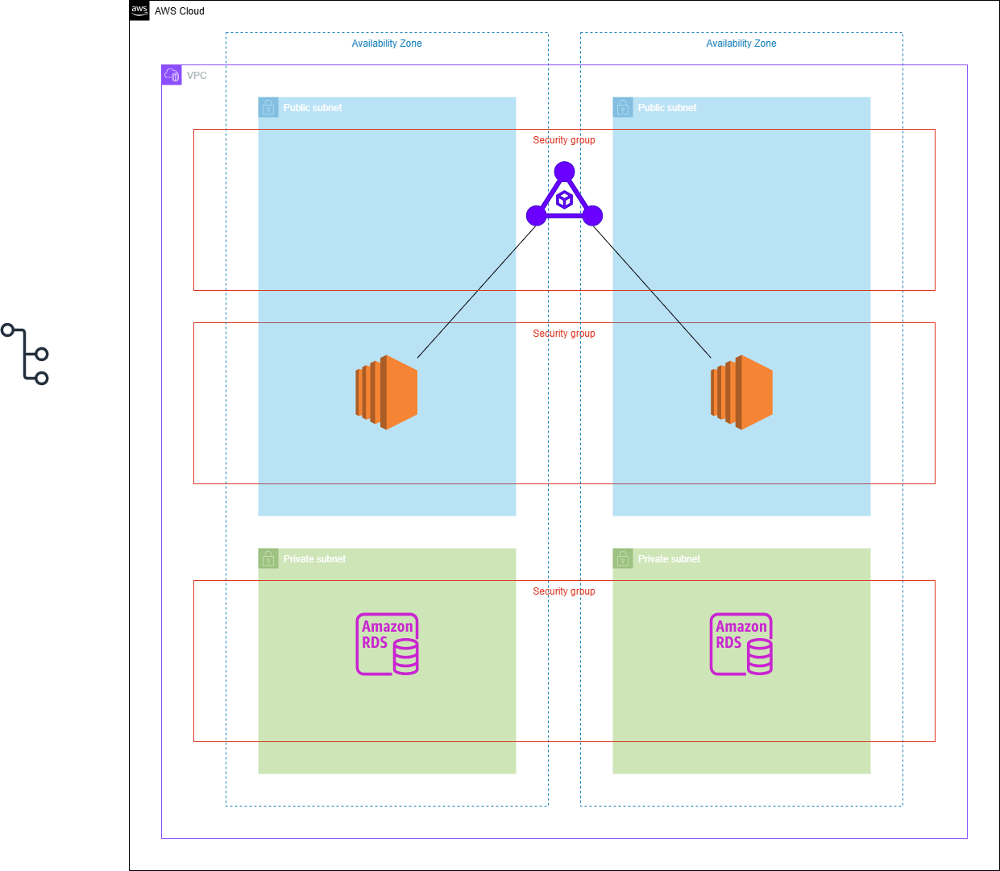

# 1.概要

このリポジトリはAWSでWEBアプリケーションを展開するためのインフラをterraformやGitHubActisonsなどで自動構築することを目的としたポートフォリオです。

※個人学習用のため若干本番で運用するには推薦できないものもありますので、コメントとして推薦事項等記載しております。

# 2.使用技術/ツール


 〇 技術 🧑‍💻

- ☁️ **AWS**
  - VPC
  - EC2 (AmazonLinux2023)
  - Route53
  - ACM
  - ELB
  - IAM
  - RDS
  - S3

- ⚙️ **Terraform**

- 🐚 **Bash**

- 🤖 **GitHub Actions**

---

 〇 ツール 🧰

- 🖥️ **GitBash**

- 💻 **VSCode**

- 🧪 **WinMerge**

- 🧠 **draw.io**


# 3.全体構成

### ☁️ **インフラ**

3層アーキテクチャ構成により、以下の役割を明確にすることによって、保守性、拡張性が向上します。

```markdown
🖥️1.プレゼンテーション層(ユーザーとのインターフェース)

⚙️2.アプリケーション層(ビジネスロジックの処理)

🗄️3.データ層(データの保存・取得)
```

どのレイヤーでエラーが発生しているかを特定することも容易なので、運用面でも優れている構成とも言えます。



🖥️ 1. プレゼンテーション層

WEBのセキュリティーグループにAplication Load Barancerを配置しています。世界中からのHTTP/HTTPSのリクエストを可能にしますが、アウトバウンドは宛先がアプリケーション層のセキュリティーグループとなっております。このように、プレゼンテーション層は外部からのアクセスを受け付けつつも、通信の出口は厳密に制限されています。これにより、不要な外部通信を防ぎ、アプリケーション層とのみ安全に連携する構成となっています。

仮にアクセスが集中しアプリケーションに負荷がかかったとしても、ALBで負荷分散できます。宛先をSGを指定することによって、アプリケーション層のインスタンスを動的に増減させた場合でも、ALBが自動的に新しいインスタンスへトラフィックを分散します。エラスティックIPやインスタンスIDに依存せず、柔軟なスケーリングが可能です。

⚙️2. アプリケーション層(ビジネスロジックの処理)

アプリケーションサーバーとしてEC2やASGを使用しています。EC2は立ち上げる際にuser_data.shを使用して、自動的にMySQLクライアントやHTTPDをインストールするように設計しました。仮に失敗したとしても失敗した旨をログとして確認できるようにし、後続処理に影響が出ないようにしております。また、ASGを使用してHTTPリクエストが大量に発生した場合でも自動的にスケールイン/スケールアウトしてくれるので、可用性が向上します。

🗄️3.データ層(データの保存・取得)

RDSでEC2インスタンスから受け取ったデータを保存します。外部からの侵入は絶対できないようにプライベートサブネットに入れています。セキュリティーグループのインバウンドはアプリケーションサーバーからのトラフィックに限られており、EC2以外のアクセスをdenyします。本来、RDSはマルチAZ構成にすることで、1つのAZに障害が発生しても自動的にスタンバイインスタンスへフェールオーバーし、サービスを継続できます。今回は学習用途のため、コストを考慮してシングルAZ構成を採用していますが、設計思想としては高可用性を意識した構成となっています。

>**💡 補足**：最近では、マルチクラスター構成が登場しており、従来のマルチAZ構成よりもさらに高速なフェールオーバーと高い可用性を実現できます。これにより、本番環境でもより堅牢なデータ層の構築が可能となっています。

### ⚙️ **IaC**

Terraformを使用したIaCを実現し、以下コマンドを打ち込み、DNSの検証を行うだけで瞬時に展開/破壊を可能にしました。

```bash
# デプロイ
terraform init
terraform plan
terraform apply

# デストロイ
terraform destroy
```

📦 モジュール構成について

本プロジェクトでは、`modules` フォルダ内に各サービスをモジュール化して管理しています。これは自己学習・ポートフォリオ目的であり、**どのサービスを使って構築しているかが一目で分かるように工夫**したものです。

〇モジュール化の目的

1. **可読性の向上**  
   - 各サービスが明確に分離されており、構成の把握が容易

2. **再利用性の向上**  
   - 同様の構成を他プロジェクトでも流用可能

3. **変数管理のしやすさ・見やすさ**  
   - 各モジュールごとに変数が整理されており、保守性が高い


〇デメリット・課題点

   - モジュールが細かすぎるため、**各変数を `output.tf` で指定して `main.tf` で個別に指定する必要がある**

   - どのサービスが**どの層（プレゼンテーション層 / アプリケーション層 / データ層）に属するかが明確でない**ため読み手によっては構成の意図が伝わりにくい可能性あり

> 💡 対策として、READMEや構成図に「層ごとのサービス分類」を明記することで、理解を補助できます

### 🤖 **CI/CD**

作成中

# 4.各種詳細設計
作成中

[アプリケーションサーバ（EC2）](modules/ec2/README.md)

```bash
#!/bin/bash

echo "Hello, "
aws s3 ls s3://my-bucket --recursive | grep '.tfstate'
```

```hcl
resource "aws_s3_bucket" "example" {
  bucket = "my-example-bucket"
  acl    = "private"
}
```

# 5.その他機能一覧

作成中

# 6.今後の課題

作成中

# 7.参考元
作成中

このポートフォリオは、*Udemy* の「AWS × Terraform 実践講座」を参考に構築しました。一部構成やコードは教材をベースにしていますが、独自に変更・拡張を加えています。