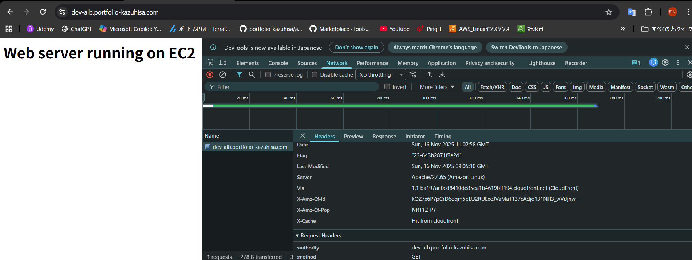

# CloudFront

概要作成中

x-Cacheという値が`Hit from cloudfront`になればクラウドフロントがしっかり作動しているということが確認できます。


## なぜCloudFrontが必要なのか

アプリケーションが仮に世界中からの高速なアクセスを要求される場合（例えば、世界的なアーティストのチケット販売のためHPなど）は、cloudFrontが必須です。
チケット販売開始直後は世界中から同時アクセスが殺到します。CloudFrontを利用することで、オリジンに直接負荷が集中せず、エッジロケーションで分散処理されます。
もちろん、cloudFrontがなくてもALB構成やオートスケーリングなどを前提として構成しているため
負荷には耐えられるとは思いますが、仮にcloudFrontがないとレイテンシが発生して、クライアントからの信頼を損ねる可能性があります。
サイトの信頼性の向上のためにも非常に重要な要素の一つであると認識しております。

## 

### 

```hcl

}
```
