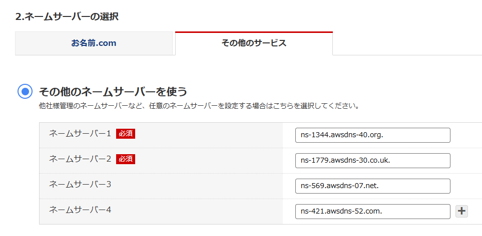
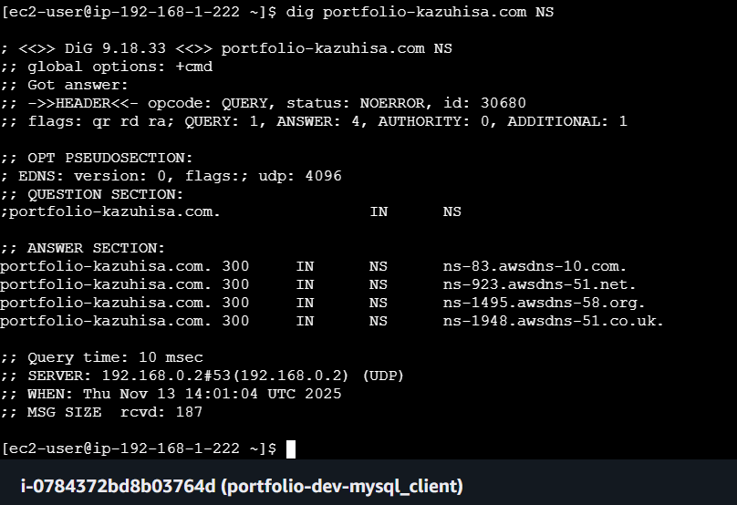
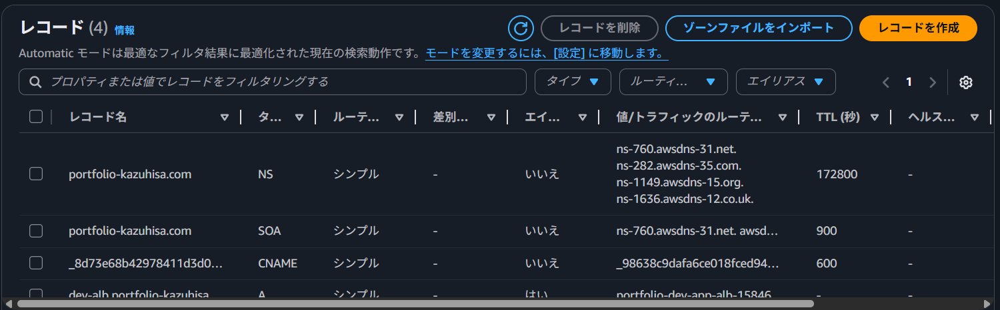

# Route53 Hosted Zone Terraform Configuration

この構成は、AWS Route53でホストゾーンを作成し、ALB向けのAレコードを登録するためのTerraform設定です。

## なぜRoute53が必要なのか？

EC2はエラスティックIPを付与していません。
なので、EC2を立ち上げる際にパブリックIPアドレスが変わってしまいます。

そのドメインを管理しているのがDNSです。
dnsをawsマネージドなサービスにしたのがroute53です。


```
[ec2-user@ip-192-168-1-222 ~]$ dig portfolio-kazuhisa.com NS

; <<>> DiG 9.18.33 <<>> portfolio-kazuhisa.com NS
;; global options: +cmd
;; Got answer:
;; ->>HEADER<<- opcode: QUERY, status: NOERROR, id: 30680
;; flags: qr rd ra; QUERY: 1, ANSWER: 4, AUTHORITY: 0, ADDITIONAL: 1

;; OPT PSEUDOSECTION:
; EDNS: version: 0, flags:; udp: 4096
;; QUESTION SECTION:
;portfolio-kazuhisa.com.                IN      NS

;; ANSWER SECTION:
portfolio-kazuhisa.com. 300     IN      NS      ns-83.awsdns-10.com.
portfolio-kazuhisa.com. 300     IN      NS      ns-923.awsdns-51.net.
portfolio-kazuhisa.com. 300     IN      NS      ns-1495.awsdns-58.org.
portfolio-kazuhisa.com. 300     IN      NS      ns-1948.awsdns-51.co.uk.

;; Query time: 10 msec
;; SERVER: 192.168.0.2#53(192.168.0.2) (UDP)
;; WHEN: Thu Nov 13 14:01:04 UTC 2025
;; MSG SIZE  rcvd: 187

[ec2-user@ip-192-168-1-222 ~]$ 

```



```
[ec2-user@ip-192-168-1-222 ~]$ dig dev-alb.portfolio-kazuhisa.com A +short
54.248.135.140
54.92.89.181
[ec2-user@ip-192-168-1-222 ~]$ dig dev-alb.portfolio-kazuhisa.com CNAME +short
[ec2-user@ip-192-168-1-222 ~]$ 

```
## 構成概要

| リソース | 説明 |
|----------|------|
| `aws_route53_zone.route53_zone` | 指定ドメインのホストゾーンを作成 |
| `aws_route53_record.route53_A_record` | ALB向けのAレコード（Alias）を作成 |

## ホストゾーンの作成

```hcl
resource "aws_route53_zone" "route53_zone" {
  name          = var.DomainName
  force_destroy = false
  tags = {
    Name    = "${var.project}-${var.environment}-app-tg"
    Project = var.project
    Env     = var.environment
  }
}
```
ホストゾーンを作成します。ホストゾーンを作成することにより、２つのレコードが作成されます。

そのうちのNSレコードが、特定のドメインのDNS情報をどのネームサーバーが管理しているかを示すDNSレコードであり、非常に重要な役割を担っています。このネームサーバを中間地点として、名前解決を行います。

## Aレコード（Alias）の登録

```hcl
resource "aws_route53_record" "route53_A_record" {
  zone_id = aws_route53_zone.route53_zone.id
  name    = "dev-alb.${var.DomainName}"
  type    = "A"
  alias {
    name                   = var.elb.dns_name
    zone_id                = var.elb.zone_id
    evaluate_target_health = true
  }
}
```

実際にアクセスするサーバーのドメインを管理しているのがAレコードで、この値でURLにアクセスすることになります。

---


