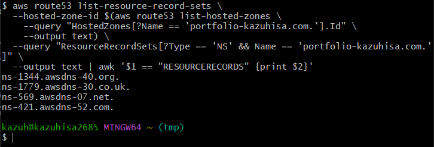
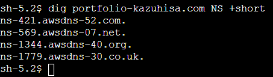

# Route53 Hosted Zone Terraform Configuration

この構成は、AWS Route53でホストゾーンを作成し、ALB向けのAレコードを登録するためのTerraform設定です。

## なぜRoute53が必要なのか？

EC2はエラスティックIPを付与していません。
なので、EC2を立ち上げる際にパブリックIPアドレスが変わってしまいます。
そのためにパブリックIPアドレスでアクセスするのは少し面倒です。
なので、IPアドレスを人間が読みやすいようなドメインに変換してくれるのがDNSです。
dnsをawsマネージドなサービスにしたのがroute53です。


## ホストゾーンの作成

```hcl
resource "aws_route53_zone" "route53_zone" {
  name          = var.DomainName
  force_destroy = false
  tags = {
    Name    = "${var.project}-${var.environment}-app-tg"
    Project = var.project
    Env     = var.environment
  }
}
```
ホストゾーンを作成します。ホストゾーンを作成することにより、２つのレコードが作成されます。
そのうちのNSレコードが、特定のドメインのDNS情報をどのネームサーバーが管理しているかを示すDNSレコードであり、非常に重要な役割を担っています。このネームサーバを中間地点として、名前解決を行います。

NSレコードをgit bashを使って確認します。

```bash
aws route53 list-resource-record-sets \
  --hosted-zone-id $(aws route53 list-hosted-zones \
    --query "HostedZones[?Name == 'portfolio-kazuhisa.com.'].Id" \
    --output text) \
  --query "ResourceRecordSets[?Type == 'NS' && Name == 'portfolio-kazuhisa.com.']" \
  --output text | awk '$1 == "RESOURCERECORDS" {print $2}
  ```
NSレコードのバリューが出てきました。


この値をレジストラに設定していきます。


これでNSレコードが確認できました。
digを使って確認できます。


## Aレコード（Alias）の登録

```hcl
resource "aws_route53_record" "route53_A_record" {
  zone_id = aws_route53_zone.route53_zone.id
  name    = "dev-alb.${var.DomainName}"
  type    = "A"
  alias {
    name                   = var.elb.dns_name
    zone_id                = var.elb.zone_id
    evaluate_target_health = true
  }
}
```

実際にアクセスするサーバーのドメインを管理しているのがAレコードで、この値でURLにアクセスすることになります。

---


