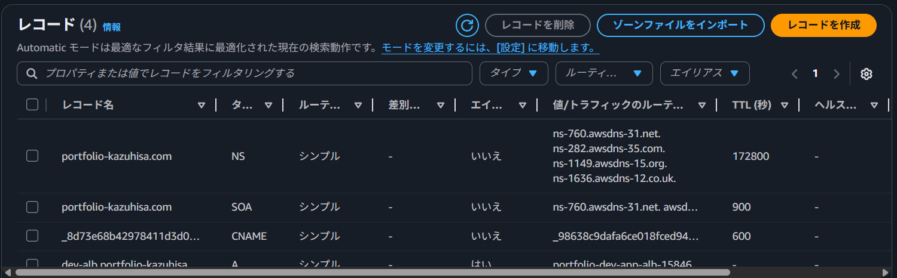

# Route53 Hosted Zone Terraform Configuration

この構成は、AWS Route53でホストゾーンを作成し、ALB向けのAレコードを登録するためのTerraform設定です。

## なぜRoute53が必要なのか？

EC2はエラスティックIPを付与していません。
なので、EC2を立ち上げる際にパブリックIPアドレスが変わってしまいます。
(そもそもALBがアクセスエンドポイントになっているので、必要がないのですが…)
じゃあ、ALBのURLを直接アクセスすればいいじゃんとなりますが、このalbのアドレスも変わってしまいます。
毎回デプロイする際にアドレスが変わるのは非常に面倒です。

そのためにドメインというものがあります。
ドメインは、簡単にいうとIPアドレスを人間がわかりやすい文字に変えてくれるものです。
ドメインについては、terraformでデストロイしようとかわりませんので、便利です。

そのドメインを管理しているのがDNSです。
で、そのdnsをawsマネージドなサービスにしたのがroute53です。

## 構成概要

| リソース | 説明 |
|----------|------|
| `aws_route53_zone.route53_zone` | 指定ドメインのホストゾーンを作成 |
| `aws_route53_record.route53_A_record` | ALB向けのAレコード（Alias）を作成 |

## ホストゾーンの作成

```hcl
resource "aws_route53_zone" "route53_zone" {
  name          = var.DomainName
  force_destroy = false
  tags = {
    Name    = "${var.project}-${var.environment}-app-tg"
    Project = var.project
    Env     = var.environment
  }
}
```
ホストゾーンを作成します。ホストゾーンを作成することにより、２つのレコードが作成されます。

そのうちのNSレコードが、特定のドメインのDNS情報をどのネームサーバーが管理しているかを示すDNSレコードであり、非常に重要な役割を担っています。このネームサーバを中間地点として、名前解決を行います。

## Aレコード（Alias）の登録

```hcl
resource "aws_route53_record" "route53_A_record" {
  zone_id = aws_route53_zone.route53_zone.id
  name    = "dev-alb.${var.DomainName}"
  type    = "A"
  alias {
    name                   = var.elb.dns_name
    zone_id                = var.elb.zone_id
    evaluate_target_health = true
  }
}
```

実際にアクセスするサーバーのドメインを管理しているのがAレコードで、この値でURLにアクセスすることになります。

---

## 注意点

- `force_destroy` を `true` にすると、Terraform管理外のレコードも削除されるため、運用環境では慎重に設定してください。
- `alias` レコードは、通常の `record` 値ではなく、ELBの `dns_name` と `zone_id` を指定する必要があります。
- `evaluate_target_health` を有効にすることで、Route53がターゲットのヘルス状態を考慮して名前解決を行います。